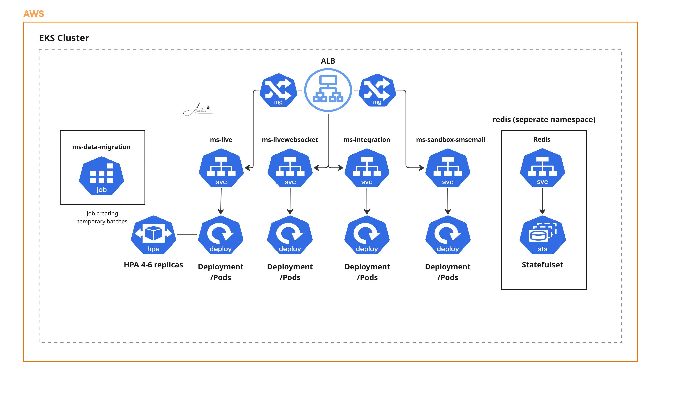

# Project 16: EKS Microservices Architecture

This repository contains the Kubernetes manifests for deploying a robust, highly available microservices architecture on Amazon EKS. Traffic routing is managed via an external Load Balancer (ALB/NLB) feeding into internal `ClusterIP` services across logically isolated namespaces (`backend` and `redis`). 

The architecture implements Horizontal Pod Autoscaling (HPA) for dynamic traffic handling on live APIs, dedicated batch-processing deployments for heavy compute workloads, and robust lifecycle hooks (Spring Boot Actuator probes, `preStop` sleeps) to ensure zero-downtime rolling updates.

## Architecture



## Services Overview

| Service | Image Source | Port | Namespace | Operational Notes |
|---|---|---|---|---|
| `ms-live` | ECR `backend/main-server` | 8080 | `backend` | Primary API. HPA enabled (min 4, max 6 replicas). |
| `ms-livewebsocket` | GCR `ms-server_websocket` | 443 | `backend` | WebSocket server. Legacy GCR upstream. |
| `ms-integration` | ECR `backend/integrations` | 443 | `backend` | Background accounting processor (2 vCPU / 4 GB). |
| `ms-sandbox-smsemail` | ECR `backend/sms-email...` | 8585 | `backend` | Notification engine. Relies on external Slack tokens. |
| `ms-data-migration` | ECR `backend/data-migration` | 443 | `backend` | Isolated batch job. Heavy compute (16 vCPU / 32 GB). |
| `redis-deployment` | DockerHub `redis:latest` | 6379 | `redis` | In-memory cache layer deployed in an isolated namespace. |

## Stack

Kubernetes (apps/v1) · Amazon EKS (eu-west-2) · AWS ECR · Spring Boot Actuator · Redis · Python 3 (Boto3)

## Prerequisites

- `kubectl` configured with RBAC access to the target EKS cluster (specifically `backend` and `redis` namespaces).
- A configured node group with sufficient raw capacity to schedule `ms-data-migration` (minimum 16 vCPU / 32 GB available), otherwise the pod will hang in a `Pending` state.
- Python 3 and `boto3` installed locally for the ECR inventory automation.

## Deployment

Before applying the application manifests, inject the required Slack secrets into the cluster to prevent CrashLoopBackOff states on the notification server:

```bash
kubectl -n backend create secret generic slack-secrets \
  --from-literal=bot-token="$SLACK_BOT_TOKEN"
```

Apply the core services and routing:

```bash
kubectl apply -f <service-folder>/kubernetes.yaml
kubectl apply -f <service-folder>/service.yaml
```

Apply the Horizontal Pod Autoscaler for the live API:

```bash
kubectl apply -f ms-live/hpa.yaml
```

## Developer Tooling: ECR Inventory (`ecr.py`)

To eliminate manual ARN lookups when updating manifests, the `ecr.py` helper script paginates all ECR repositories in the target region and outputs ready-to-paste image URIs:

```text
<repo_id>.dkr.ecr.eu-west-2.amazonaws.com/<repo_name>:<tag>
```

## Architectural & Operational Notes

- **Lifecycle Management:** All deployments utilize `RollingUpdate` strategies paired with `/actuator/health` liveness/readiness probes. A `preStop` sleep hook (20–60s) is enforced to ensure graceful connection draining before SIGTERM is sent.
- **Deployment Strategy Caveats:** The `accounting-master` service is configured with `maxSurge: 100%` and `maxUnavailable: 100%`, effectively mirroring a `Recreate` strategy. While acceptable for stateless background processors, this configuration must never be applied to live-traffic APIs.
- **HPA Threshold Tuning:** The HPA on `ms-live` targets `350%` average CPU utilization. This indicates the pod CPU `requests` are severely under-provisioned relative to actual baseline usage. The container requests should be profiled and re-baselined to allow for a standard ~70% scaling threshold.
- **Technical Debt (Kubernetes API):** The current HPA manifests utilize `autoscaling/v2beta1`. This API version is officially removed in Kubernetes 1.26. The manifests must be migrated to `autoscaling/v2` prior to the next cluster control-plane upgrade.
